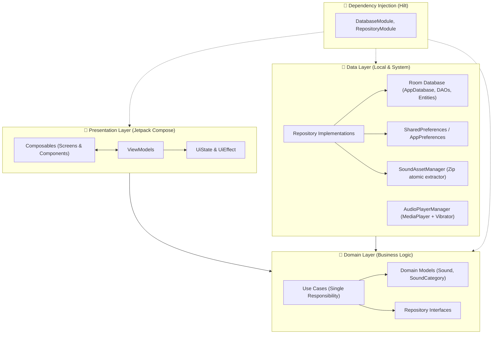

# ✂️ Haircut Prank & Funny Sounds (Âm Thanh Trêu Đùa) 🔊

<p align="center">
  
</p>

<p align="center">
  <b>Ứng dụng Android giả lập âm thanh chơi khăm chân thực và hài hước, được xây dựng theo kiến trúc Clean Architecture với Jetpack Compose hiện đại.</b>
</p>

<p align="center">
  <a href="https://kotlinlang.org/"></a>
  <a href="https://developer.android.com/jetpack/compose"></a>
  <a href="https://dagger.dev/hilt/"></a>
  <a href="https://developer.android.com/training/data-storage/room"></a>
  <a href="https://developer.android.com/about/versions/oreo"></a>
  <a href="https://developer.android.com/"></a>
</p>

---

## 📖 Giới thiệu (Overview)

**Haircut Prank & Funny Sounds** là ứng dụng Android vui nhộn giúp bạn biến chiếc smartphone thành một công cụ trêu đùa bạn bè đỉnh cao. Từ tiếng **tông đơ cắt tóc** rung giật như thật, tiếng **còi hơi (air horn)** chói tai cho tới các âm thanh hài hước như **tiếng xì hơi (fart)**, **súng**, **còi cảnh sát**, **động vật**, **meme**, v.v.

Ứng dụng được thiết kế tối ưu với giao diện trực quan, hoạt ảnh Lottie bắt mắt, chế độ hẹn giờ phát âm thanh tinh tế và hỗ trợ phản hồi xúc giác rung (haptic vibration) chân thực.

---

## ✨ Tính năng nổi bật (Key Features)

- ✂️ **Tông đơ cắt tóc chân thực (Hair Clipper)**: Âm thanh dao cạo sắc nét kết hợp nhịp rung xúc giác (haptic vibration) tạo cảm giác như đang cạo tóc thật.
- 📢 **Hơn 300+ hiệu ứng âm thanh hài hước**:
  - 🎺 *Air Horn (Còi hơi sự kiện)*
  - 💨 *Fart & Burp (Xì hơi, ợ hơi)*
  - 🚨 *Police Siren & Alarm (Còi cảnh sát, báo động)*
  - 🔫 *Gun & Bomb (Tiếng súng, bom nổ)*
  - 🚗 *Car Sounds (Còi xe, động cơ gầm rú)*
  - 🐶 *Animals (Tiếng chó, mèo, muông thú)*
  - 💥 *Breaking Sounds (Kính vỡ, đồ vỡ)*
  - 🚽 *Toilet Flushing (Xả bồn cầu)*
  - 😂 *Meme Sounds & Scary Sounds*
- ⏱️ **Hẹn giờ trêu đùa (Prank Countdown Timer)**: Hẹn giờ đếm ngược (5s, 10s, 30s, 1 phút, 5 phút). Đặt điện thoại ở chỗ kín và âm thanh sẽ tự động vang lên khiến đối phương bất ngờ!
- 🔁 **Chế độ phát lặp vô hạn (Loop Mode)**: Giữ âm thanh phát liên tục không bị gián đoạn.
- 📳 **Đồng bộ hiệu ứng rung (Haptic Feedback)**: Tự động rung theo nhịp âm thanh, tương thích từ Android 8.0 (API 26) đến Android 16 (API 36 - `VibratorManager`).
- ⭐ **Mục yêu thích (Favorites)**: Đánh dấu các âm thanh hay dùng nhất và phát nhanh ngay tại màn hình Yêu thích.
- 🆕 **Huy hiệu âm thanh mới (New Sound Badges)**: Dễ dàng nhận diện các hiệu ứng âm thanh vừa được bổ sung vào bộ sưu tập.
- 📦 **Quản lý tài nguyên nguyên tử (Atomic Asset Extraction)**: Tự động giải nén gói âm thanh tích hợp, kiểm tra tính toàn vẹn file (`AssetIntegrity`) và tự động đồng bộ/khôi phục dữ liệu yêu thích của người dùng khi cập nhật.
- 🎨 **Giao diện hiện đại (Modern Compose UI)**: Sử dụng Material 3, bảng màu gradient bắt mắt, hoạt ảnh Lottie sinh động cùng font chữ độc đáo *Titan One*.

---

## 🏛️ Kiến trúc dự án (Architecture)

Dự án áp dụng chặt chẽ mô hình **Clean Architecture** kết hợp mô hình **MVI / MVVM (Model-View-Intent / ViewModel)** để đảm bảo tính module hóa, dễ bảo trì và dễ viết kiểm thử:



### Các tầng trong hệ thống:
1. **Presentation Layer**:
   - Sử dụng 100% **Jetpack Compose** (Declarative UI).
   - Quản lý trạng thái thông qua `UiState`, `UiAction/UiEvent` và `UiEffect` (One-shot event qua Coroutines Channel).
   - Điều hướng màn hình thông qua `Navigation Compose` (`AppNavHost`).
2. **Domain Layer**:
   - Chứa các `UseCase` độc lập (như `GetSoundsByCategoryUseCase`, `ToggleFavoriteUseCase`, `PrepareInitialDataUseCase`,...).
   - Độc lập hoàn toàn với Android Framework.
3. **Data Layer**:
   - **Room Database**: Lưu trữ thông tin phân loại (`CategoryEntity`) và danh sách âm thanh (`SoundEntity`).
   - **AudioPlayerManager**: Quản lý vòng đời `MediaPlayer` và bộ rung `Vibrator` / `VibratorManager`.
   - **SoundAssetManager**: Giải nén bộ tài nguyên zip một cách nguyên tử (Atomic Unzip), loại bỏ rác MacOS (`__MACOSX`, `.DS_Store`), đảm bảo dữ liệu không bị hỏng giữa chừng.
4. **Dependency Injection**:
   - Sử dụng **Dagger Hilt** để tiêm phụ thuộc cho Database, Repositories, UseCases và ViewModels.

---

## 📁 Cấu trúc thư mục (Project Structure)

```text
com.example.comthupohaircut/
├── App.kt                               # Application class (@HiltAndroidApp)
├── MainActivity.kt                      # Single Activity với Jetpack Compose Host
├── data/
│   ├── audio/
│   │   └── AudioPlayerManager.kt        # Quản lý phát nhạc & rung Haptic Feedback
│   ├── local/
│   │   ├── AppDatabase.kt               # Room Database
│   │   ├── dao/                         # CategoryDao, SoundDao
│   │   ├── entity/                      # CategoryEntity, SoundEntity
│   │   └── pref/                        # AppPreferences (SharedPreferences)
│   ├── repository/                      # CategoryRepositoryImpl, SoundRepositoryImpl,...
│   └── util/                            # AssetIntegrity, SoundAssetManager, Constants
├── di/
│   ├── DatabaseModule.kt                # Hilt Module cung cấp Database & DAOs
│   └── RepositoryModule.kt              # Hilt Module cung cấp Repositories
├── domain/
│   ├── model/                           # Sound, SoundCategory
│   ├── repository/                      # Interfaces của các Repositories
│   └── usecase/                         # UseCases cho các nghiệp vụ chính
├── presentation/
│   ├── navigation/                      # Screen & AppNavHost (Navigation Compose)
│   ├── screens/
│   │   ├── splash/                      # Splash Screen & Giải nén dữ liệu ban đầu
│   │   ├── intro/                       # Màn hình Onboarding hướng dẫn
│   │   ├── main/                        # Bottom Navigation (Home & Favorite)
│   │   ├── home/                        # Màn hình Home danh mục âm thanh
│   │   ├── listsound/                   # Màn hình danh sách âm thanh theo nhóm
│   │   ├── detail/                      # Màn hình phát âm thanh, hẹn giờ, rung, lặp
│   │   ├── favorite/                    # Màn hình quản lý âm thanh yêu thích
│   │   └── setting/                     # Màn hình cài đặt, đánh giá, chính sách
│   └── theme/                           # Color, Theme, Type (Jetpack Compose)
└── assets/
    └── taymay_haircut_version_4.zip     # Kho dữ liệu âm thanh và hình ảnh đóng gói sẵn
```

---

## 🛠️ Công nghệ & Thư viện (Tech Stack)

| Thành phần | Công nghệ / Thư viện | Phiên bản |
| :--- | :--- | :--- |
| **Ngôn ngữ** | Kotlin | 2.2.10 |
| **UI Framework** | Jetpack Compose BOM | 2026.02.01 |
| **Design System** | Material 3 | - |
| **Architecture** | Clean Architecture + MVI/MVVM | - |
| **Dependency Injection** | Dagger Hilt | 2.60.1 |
| **Database** | Room Database (KTX + KSP) | 2.6.1 |
| **Xử lý bất đồng bộ** | Kotlin Coroutines & Flow | 1.9.0 |
| **Tải ảnh** | Coil Compose | 2.7.0 |
| **Animation** | Lottie Compose | 6.6.0 |
| **Navigation** | Navigation Compose & Hilt Navigation | 1.2.0 |
| **Build Tool** | Android Gradle Plugin (AGP) / Gradle KTS | 9.1.1 |

---

## 🚀 Hướng dẫn cài đặt & Chạy ứng dụng (Getting Started)

### Yêu cầu môi trường:
- **Android Studio**: Ladybug / Meerkat / Hedgehog hoặc mới hơn.
- **JDK**: Java Development Kit 11 trở lên.
- **Android SDK**:
  - `minSdk`: **26** (Android 8.0 Oreo)
  - `targetSdk`: **36** (Android 16)
  - `compileSdk`: **36**

### Các bước cài đặt:

1. **Clone repository về máy:**
   ```bash
   git clone https://github.com/DoAnhThu832004/Haircut-Prank.git
   ```

2. **Mở dự án trong Android Studio:**
   - Chọn `File` -> `Open...` và trỏ tới thư mục vừa clone.
   - Đợi Android Studio đồng bộ Gradle (Gradle Sync) và tải các dependencies.

3. **Build & Run:**
   - Chọn thiết bị thử nghiệm (Máy ảo Emulator hoặc Thiết bị thật chạy Android 8.0+ có bật USB Debugging).
   - Nhấn nút **Run ▶️** (hoặc tổ hợp phím `Shift + F10` trên Windows / `Control + R` trên macOS).

   *Hoặc build APK Debug bằng dòng lệnh:*
   ```bash
   # Trên Windows PowerShell:
   .\gradlew.bat assembleDebug

   # Trên macOS / Linux:
   ./gradlew assembleDebug
   ```
   File APK sẽ được tạo tại đường dẫn: `app/build/outputs/apk/debug/app-debug.apk`.

---

## 🔒 Quyền hạn ứng dụng (Permissions)

Ứng dụng chỉ sử dụng các quyền cần thiết tối thiểu để phục vụ trải nghiệm người dùng:
- `android.permission.VIBRATE`: Dùng để tạo hiệu ứng rung chân thực khi phát âm thanh tông đơ hoặc các âm thanh chơi khăm.

---

## 🤝 Đóng góp (Contributing)

Mọi ý kiến đóng góp, báo cáo lỗi (issues) hoặc pull request đều rất được hoan nghênh:
1. Fork dự án
2. Tạo nhánh tính năng mới (`git checkout -b feature/AmazingFeature`)
3. Commit thay đổi (`git commit -m 'Add some AmazingFeature'`)
4. Push lên nhánh của bạn (`git push origin feature/AmazingFeature`)
5. Mở một Pull Request trên GitHub

---

## 👤 Tác giả (Author)

- **DoAnhThu832004** - [GitHub Profile](https://github.com/DoAnhThu832004)
- **Repository**: [Haircut-Prank](https://github.com/DoAnhThu832004/Haircut-Prank)

---

<p align="center">⭐ Đừng quên tặng 1 sao cho dự án nếu bạn thấy hữu ích nhé! ⭐</p>
